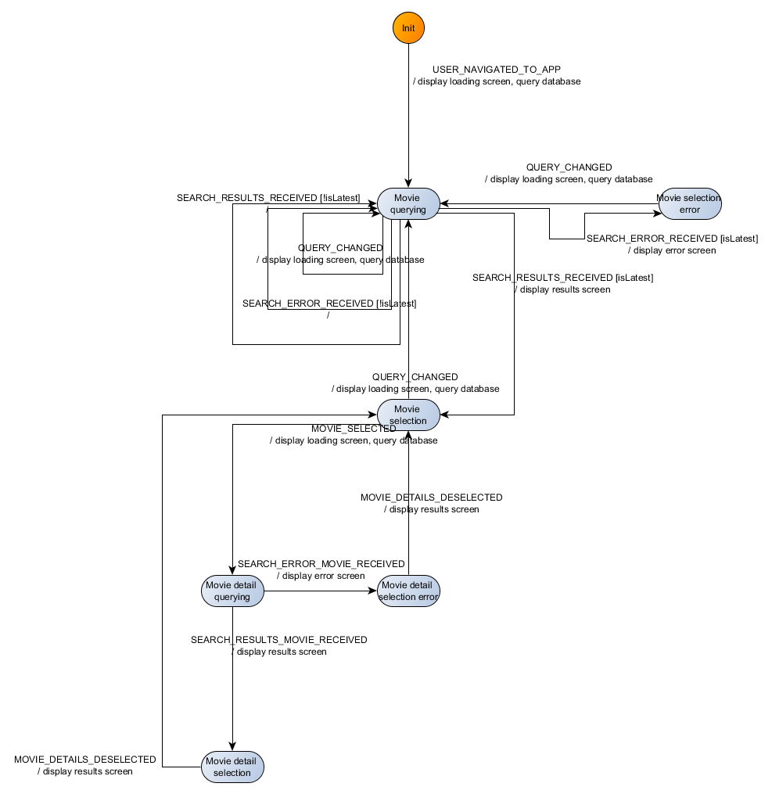

# Motivation
This demo aims at showing how state machines can be used to modelize reactive systems, in 
particular user interfaces. They have long been used for embedded systems, in particular for 
safety-critical software.

Our stack consists of :
 - `cyclejs` as central controller
- `react` as DOM library
- `react-transducer` as state machine library
- `superagent` as http request library
- `rxjs` to handle events

# Key points
This demo shows an example of integration of React library with cyclejs. We make use of an event 
handler (subject) to pass events to an associated component. The component processes the received
 events and produces commands, which are executed by the command driver. The command driver is 
 configured with all the relevant dependencies which it needs to run the commands. Here the 
 dependencies are mostly `superagent` for fetching remote data and `React` for rendering.
 
Note that in this simple case (one unique component), we need not use cycle DOM driver, nor 
isolation features. Event handlers are directly set on the related element in a view, and the 
event source for the component is pre-injected in the event handler. As a result, the component 
receives automatically the events it is interested in without resorting to isolation, or using 
`DOM.select(..)` calls. 

Note as well that the behaviour of the component is defined by a state machine, which offers a 
stream-free interface to event handling (it is just a function). This simplifies the 
code, while allowing to take advantage of the automatic visualization, tracing, and testing of 
state machines.

The corresponding machine is reproduced here :

 

# Further work
Develop that pattern to orchestrate several concurrent components.
